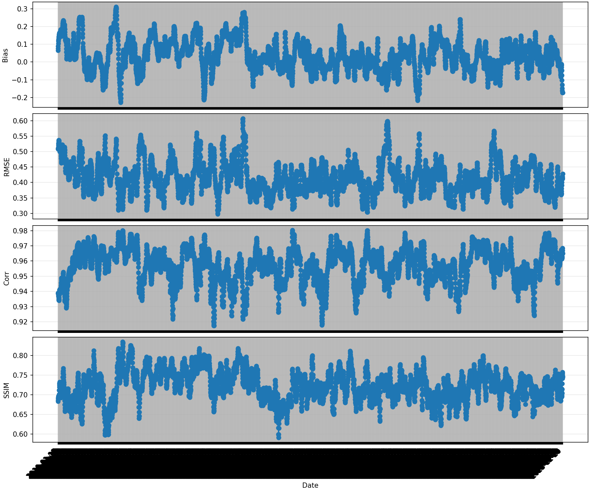
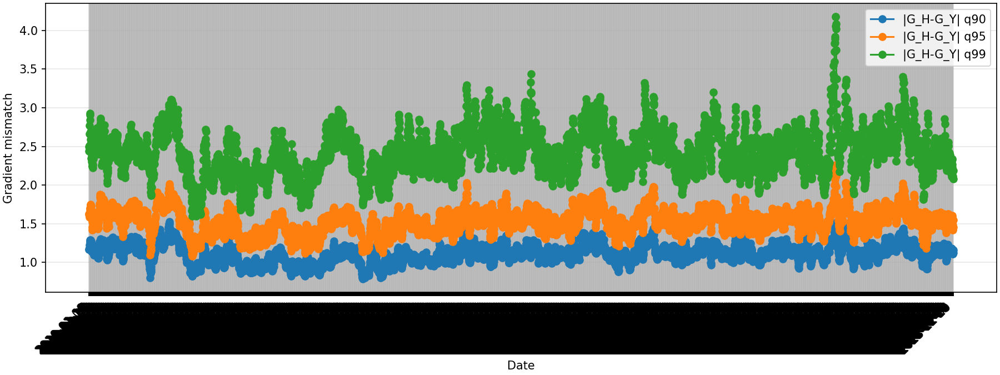
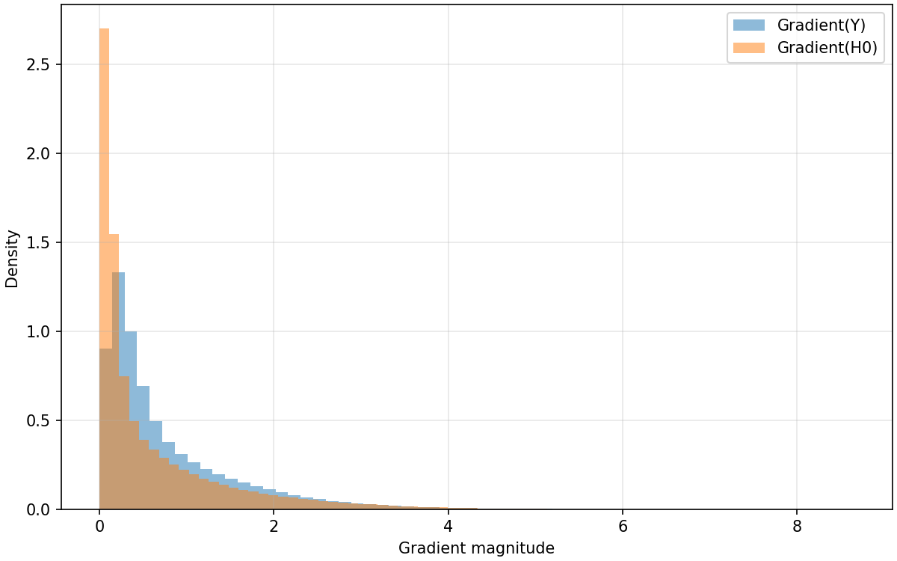
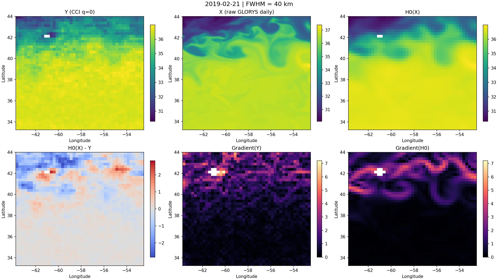
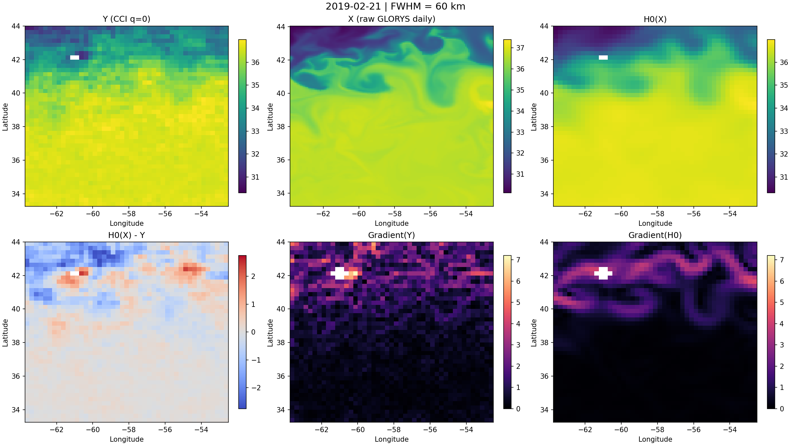

# Observation-Space Evaluation of GLORYS Salinity Against ESA CCI SSS

<h1>Observation-Space Evaluation of GLORYS Salinity Against ESA CCI SSS</h1>

Sensitivity of the H0 observation operator to Gaussian footprint width from 30 km to 60 km

Study window: 2010-01-09 to 2023-12-30 
Common evaluation sample: 5088 daily fields per FWHM setting 
Repository path: glorys_smos_h0_comparison/

## Executive Summary

This report evaluates how the observation-space operator applied to GLORYS sea-surface salinity responds to different Gaussian smoothing widths. The comparison was performed on the common set of 5088 valid daily files shared by the 30 km, 40 km, 50 km, and 60 km experiments. Across the full common period, the ranking is monotonic: 60 km outperforms 50 km, 40 km, and 30 km on RMSE, correlation, SSIM, and gradient-mismatch quantiles, while mean absolute bias remains nearly unchanged. The present evidence therefore indicates that the main gain comes from better spatial-scale matching between GLORYS and ESA CCI observations, not from mean-bias correction.

The best configuration tested so far is 60 km. Relative to the long-used 40 km reference, 60 km reduces mean RMSE by 5.81%, improves the mean correlation from 0.951748 to 0.957010, improves the mean SSIM from 0.703210 to 0.722482, and reduces the mean gradient-mismatch q95 by 9.88%. Relative to 50 km, 60 km still delivers a further 2.90% RMSE improvement and a 4.65% reduction in gradient-mismatch q95. Because the performance trend is still improving at 60 km, testing 70 km and 80 km remains the logical next step if the objective is to identify the effective observation footprint rather than only improve on the 40 km baseline.

## 1. Observation Operator and Metrics

The comparison is not made between raw GLORYS and raw ESA CCI salinity fields. GLORYS is first mapped into observation space through the operator below:

H₀(X) = M(R(K(T(X))))

where `X` is the raw daily GLORYS salinity, `T` is the 7-day temporal average, `K` is a normalized Gaussian blur with prescribed FWHM, `R` is the area-weighted regridding to the ESA CCI 0.25° grid, and `M` is the valid-observation mask derived from the `sss_qc = 0` criterion.

The main scalar diagnostics are computed over the valid observation mask:

Bias = (1 / N) Σᵢ (H₀,ᵢ - Yᵢ)

RMSE = sqrt((1 / N) Σᵢ (H₀,ᵢ - Yᵢ)²)

Corr = corr(H₀, Y)

SSIM = structural similarity index between the masked CCI field and the masked H₀ field

G(S) = sqrt((∂S/∂lat)² + (∂S/∂lon)²),  qₚ = Qₚ(|G(H₀) - G(Y)|)

Here `q90`, `q95`, and `q99` are the 90th, 95th, and 99th percentiles of the absolute gradient-mismatch field.

## 2. Common-Date Quantitative Comparison

Table 1 summarizes the common-date means used to compare all four FWHM settings on exactly the same 5088 valid daily files.

| FWHM (km) | Days | Mean abs bias | Mean RMSE | Mean corr | Mean SSIM | Mean grad q90 | Mean grad q95 | Mean grad q99 |
| --- | ---: | ---: | ---: | ---: | ---: | ---: | ---: | ---: |
| 30 | 5088 | 0.074553 | 0.454308 | 0.948903 | 0.693320 | 1.267493 | 1.801558 | 3.037775 |
| 40 | 5088 | 0.074443 | 0.440967 | 0.951748 | 0.703210 | 1.210640 | 1.696030 | 2.791023 |
| 50 | 5088 | 0.074299 | 0.427743 | 0.954496 | 0.713120 | 1.158401 | 1.603085 | 2.584369 |
| 60 | 5088 | 0.074123 | 0.415325 | 0.957010 | 0.722482 | 1.114808 | 1.528542 | 2.426100 |

Three points matter most.

1. The ranking is fully monotonic: 60 km > 50 km > 40 km > 30 km.
2. Mean absolute bias changes only weakly across the four settings, so the benefit is dominated by spatial-structure matching.
3. The gradient-mismatch quantiles decrease steadily with increasing FWHM, which means the broader footprint better matches the observation-space smoothness seen by ESA CCI.

<strong>Key result.</strong> The 60 km setting is the current best tested footprint. Compared with 40 km, it improves mean RMSE by 5.81% and mean gradient-mismatch q95 by 9.88%. Compared with 50 km, it still improves RMSE by 2.90% and gradient-mismatch q95 by 4.65%.

## 3. Full-Period Visual Diagnostics for the Best Setting

The full-period 60 km time series confirms that the gain is not concentrated in one short interval. RMSE, correlation, and SSIM remain in a consistently favorable regime over the full 2010-2023 period, even though the daily curves remain naturally noisy.

Figure 1. Full-period daily bias, RMSE, correlation, and SSIM for the 60 km experiment. The x-axis is intentionally dense because the objective is to show long-run stability rather than individual-day readability.

The gradient diagnostics show the same conclusion from a structural perspective. The 60 km configuration lowers the upper-tail mismatch of gradient magnitude, which is exactly what one expects from a better effective footprint match.

Figure 2. Daily gradient-mismatch quantiles for the 60 km configuration.

Figure 3. Distribution-level comparison of gradient magnitudes between the observed field and H₀ at 60 km.

## 4. Representative Daily Case: 2019-02-21

The date 2019-02-21 is a useful representative case because it contains a strong meridional contrast and localized frontal structure. It is therefore a harder test than a weak-gradient background day.

Table 2 compares the 40 km and 60 km settings on that same date.

| Date | FWHM (km) | Valid count | Bias | RMSE | Corr | SSIM | Grad q95 |
| --- | ---: | ---: | ---: | ---: | ---: | ---: | ---: |
| 2019-02-21 | 40 | 1933 | -0.121109 | 0.621004 | 0.938022 | 0.693102 | 2.097808 |
| 2019-02-21 | 60 | 1933 | -0.121683 | 0.594053 | 0.943132 | 0.708328 | 1.977164 |

On this day, the 60 km configuration reduces RMSE by 4.34% and lowers the gradient-mismatch q95 by 5.75% relative to 40 km, while also increasing both correlation and SSIM. The visual difference is not dramatic everywhere, but the mismatch field becomes more spatially coherent and less noisy once the broader footprint is used.

Figure 4. Representative 40 km daily panel on 2019-02-21.

Figure 5. Representative 60 km daily panel on 2019-02-21.

## 5. Interpretation

The most important scientific interpretation is that the effective observation footprint in the present setup is broader than 40 km and is still not saturated at 60 km. This explains why the absolute bias stays almost fixed while RMSE, correlation, SSIM, and gradient consistency continue to improve with increasing footprint size. In other words, the operator is already mean-consistent, but the spatial smoothing scale used to place GLORYS into observation space is still being tuned.

The monotonic improvement from 30 km to 60 km suggests that the previous 40 km assumption was too sharp for the ESA CCI product over this domain. The present experiments therefore support a revised working hypothesis: the practical footprint sensed by the observation product, once temporal averaging, regridding, and masking are all accounted for, is likely closer to 60 km than to 40 km.

## 6. Recommendations

1. Use 60 km as the current best operational setting for the H0 comparison workflow.
2. Run the same full-period pipeline at 70 km and 80 km to determine whether the performance curve plateaus or reverses.
3. If the monotonic improvement continues, consider fitting a simple response curve of RMSE or gradient-mismatch q95 versus FWHM to estimate the optimum footprint more systematically.

## Appendix: Files Included in Version Control

This report is backed by lightweight, shareable outputs only:

- `glorys_smos_h0_comparison/results/fwhm_30_40_50_60_comparison_common_dates.csv`
- `glorys_smos_h0_comparison/results/fwhm_30_40_50_60_comparison_common_dates.md`
- `glorys_smos_h0_comparison/results/representative_case_20190221_40_60km.csv`
- representative PNG figures copied into `glorys_smos_h0_comparison/docs/report_assets/`

Large intermediate directories such as daily pair files, daily H0 NetCDF outputs, and full daily-panel archives remain local and are intentionally excluded from Git because they are too large for efficient repository storage.

